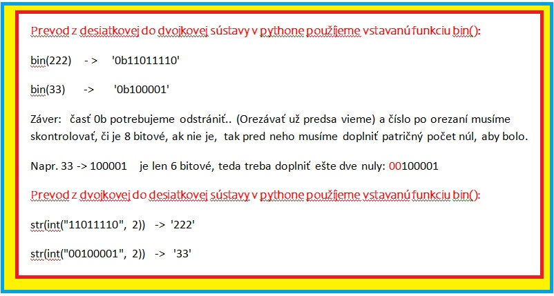
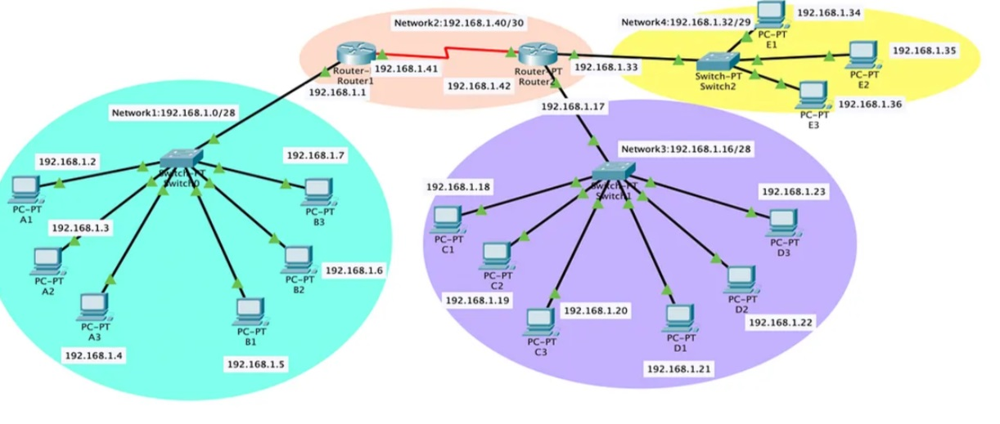

# Sú dve alebo viacere zariadenia v jednej sieti ????

Najprv si prečítajme a preštudujme dokument ip.pdf &nbsp;
[Základy o ip adresách a maskách](./ip.pdf)

## Nutné vedomosti sú:
    
1) Prevody z dvojkovej do desiatkovej sústavy a naopak
   Prevody nebudeme robiť nejakým naprogramovaním nejakých funkcíi.
   Použijeme na to vstavané funkcie, kt. si treba najprv odskúšať ako fungujú. (Pozrite si obrázok nižšie...)

   

2) Pochopenie logického súčinu

        V súbore ip.pdf

 
 

Ilustráčný obrázok

## 1) ZADANIE

Máme dve zariadenia (PC).

    Adresa IP1 zariadenia je: 192.168.250.46
    Maska1 (subnet1) je: 255.255.255.224

    Adresa IP2 zariadenia je: 192.168.250.68
    Maska (subnet2) je: 255.255.255.240

 Úloha:

 *Zistite, či tieto dve zariadenia sú v jednej sieti ???*

 Poznámka:

 *Nepoužívajte žiadne moduly.*

 ## Návrh riešenia

 Budeme vychádzať zo súboru ip.pdf.  Zariadenia sú  v jednej sieti vtedy, ak majú rovnakú sieť. No a my musíme vypočítať do akej
 siete patrí prvé zariadenie a do akej druhé zariadenie. Následne vypočítané sisete porovnáme. 

napíšeme funkciu na premenu IP adresy (v dekadickom tvare) do binárneho reťazca

napíseme funkciu na premenu binárneho reťazca na IP adresu (v dekadickom tvare)

napíšeme funkciu na výpočet siete (logický súčin), kt. urobí log. súčin bin. reťazca IP a bin. reťazca masky a následne prevedie tento výsledok na IP adrersu v dekadickom tvare

